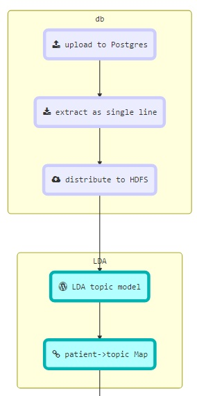
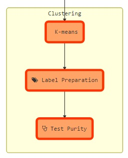

### Sepsis Prediction


#### Flow


<br>



#### 1. Database Preparation

##### Load

Data for `NOTEEVENTS` is loaded in `Postgres` as follows,

```mysql
\copy NOTEEVENTS from 'NOTEEVENTS.csv' delimiter ',' csv header NULL ''
```

`Postgres` loads the data correctly even though it contains *newline* characters. As such this forms the very first step in our analysis.

##### Extract

Then we can extract the data into a *CSV* file for loading into the big data stack, namely `HDFS`. During this process, we replace the *newline* characters with spaces, thus enabling us to view the record in a single line.

```mysql
psql -d mimic <<EOF
copy (select subject_id, string_agg (regexp_replace(text,E'[\\n\\r]+', ' ', 'g' ), ' ') as text
      from noteevents group by subject_id)
to  '/my/path/proj/data/consolidated_notes.csv' with csv delimiter ',' ;
EOF
```

##### HDFS Load

The data thus generated can be loaded to HDFS by simply calling,

```bash
hdfs dfs -put consolidated_notes.csv /my/hdfs/path/project/input/notes
```

#### 2. LDA Analysis

##### Build Project

Following items are hard coded and will need to be changed,

+ input path: The input path for the notes is hard coded in the `LdaProcessing.scala` as `"/user/af55267/project/notes/consolidated_notes.csv"`. This can be changed by modifying the line and building the project.
+ model location for storage: `"/user/af55267/project/lda_model"`, this is where the model is stored in case there is a need to load it later.

The project can be built as follows,

```scala
sbt clean compile package
```

This generates the jar `target/scala-2.10/project_2.10-0.1.jar` which is used by the `runner.sh`

##### Run Spark job

LDA is run using `Spark` . A shell script is provided which performs the task of submitting the spark job to the Yarn cluster. It can be invoked as follows,

```bash
bash runner.sh
Usage: runner.sh
        -s <mode:local/yarn>
        -t <numTopics>
        -i <maxIterations>
        -k <keytab>
        -p <principal>
        -o <output HDFS dir>
        -w <stopwords>			  		
```

Keytab and principal are only needed if the cluster has been `kerberized`.

##### Output

The job produces 3 outputs,

1. Topics: List of topics and the top 10 words associated with each topic
2. Topics per Document: topics associated with each document, i.e. each patient.
3. Documents per Topic: Top 10 documents for each topic.

These files are consolidated and downloaded for further analysis.

#### 3. Clustering via K-means

K-means takes the topics per document as its input and creates a clustering of the patients.

##### Label Preparation

The patients from the above LDA analysis and the corresponding topics are loaded into a table `subject_topic`. All future analysis will be performed on the patients from this table.

Sepsis is designated by 3 codes - `sepsis`, `severe sepsis`, `septic shock`
We can tie these codes to the patients to determine affliction of sepsis.
These codes are represented by the `icd9` codes - *99591,99592,78552*

The first step in the analysis is the creation of labels for the patients. In this case there are two labels- septic and non-septic. This is performed from the `Postgres` database as follows,

```sql
COPY (
SELECT a.subject_id,
          CASE '{99591,99592,78552}':: character varying[] && codes
              WHEN 't' THEN 1
              ELSE 0
          END AS sepsis_yn
   FROM   subject_topic a
   LEFT   JOIN
    	  (SELECT subject_id, array_Agg(icd9_code) codes
      	    FROM diagnoses_icd
      	   GROUP BY subject_id) b 
     ON  a.subject_id=b.subject_id
) to '/my/path/proj/data/subjectSepsis.csv'
With CSV DELIMITER ',';
​```
```

The file generates from above command is uploaded to HDFS for K-means analysis.

#### K-means analysis
Assuming we have the subject-topic and subject-sepsis files ready, the clustering algorithm can be run as follows,
1. copy both files to HDFS
2. run `kmeans` as follows,
```bash
bash kmeans.sh \
-s yarn -x \
-t project/kmeans/subjectMultiTopic.csv \
-m project/kmeans/subjectSepsis.csv \
-k myt.keytab \
-p MY@PRINCIPAL.COM
```

#### Results

For 20 topic output, the purity results are as follows,

K-means purity = **0.8996857731065121**

